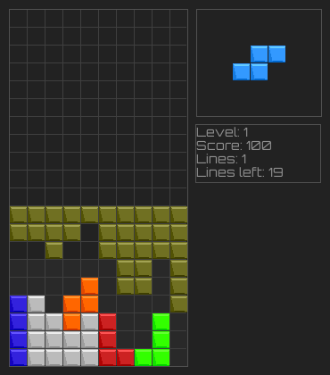
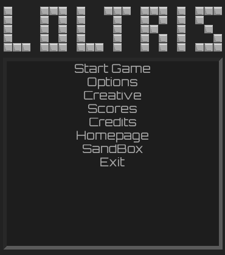

Loltris
=======

Loltris is a tetris clone written in Python/Pygame, it currently has the following
features.

* Features
  * Tetromino creator
  * Tetris game
    * Preview of next block
    * Status information
    * "Ghostpiece"
    * "Über-Tetromino" joke feature that automatically creates a "perfect" tetromino
    * Flipping (flip the blocks)
  * Highscore list
  * Interactive menus, with mouse support (wow...)
    * Mouse and arrow-keys can be used interchangeably
  * Modifiable keymap
  * Options-menu

## Screenshots

## Issues

* Planed features
  * Detailed highscore list
  * Online/multiplayer functionality
    * server/client
